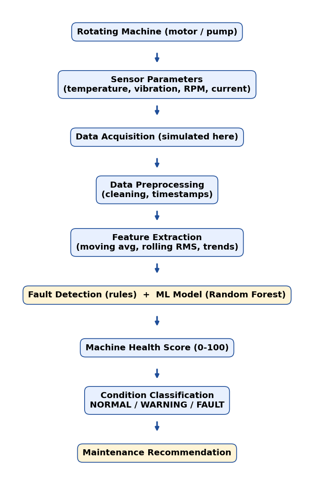

🚀 **[OPEN LIVE DASHBOARD](https://predictive-maintenance-system-heop22mxgrm67yxx5hg.streamlit.app)**

# Rotating Machinery Predictive Maintenance System

> **Portfolio / learning project. ALL sensor data is SIMULATED.** No real machine or sensor is used. Thresholds are *project-defined demonstration thresholds*, not values from a standard or manufacturer. This is **not** an industrial-certified system.

## 1. Project overview
A Python condition-monitoring tool for a rotating machine (e.g. induction motor driving a pump). It reads temperature, vibration, RPM and motor current, classifies the machine as **NORMAL / WARNING / FAULT**, gives a 0-100 **health score**, a **possible cause**, a **maintenance recommendation**, and compares a transparent rule-based detector with a Random Forest model. A Streamlit dashboard ties it together.

## 2. Problem statement
Unplanned breakdowns of motors and pumps cause downtime and costly repairs. Time-based (preventive) servicing can replace healthy parts or still miss early failures. Trending condition data can reveal degradation early, so maintenance is done *when the machine needs it*.

## 3. Objectives
- Generate realistic simulated data with gradual degradation
- Extract engineering indicators (moving averages, rates of change, rolling RMS)
- Detect faults with transparent, adjustable rules
- Compute an explainable health score
- Train and honestly evaluate a simple ML classifier
- Present everything in a dashboard with maintenance recommendations

## 4. System architecture


```
Rotating Machine -> Sensor Parameters -> Data Acquisition -> Data Preprocessing
 -> Feature Extraction -> Fault Detection / ML Model -> Machine Health Score
 -> Condition Classification -> Maintenance Recommendation
```

## 5. Engineering parameters
| Parameter | Meaning | Why it matters |
|---|---|---|
| Vibration (mm/s RMS) | Effective (root-mean-square) vibration velocity | Most sensitive early indicator of imbalance, misalignment, looseness, bearing wear |
| Temperature (°C) | Housing/bearing temperature | Rises with friction, poor lubrication, overload; slow to react (thermal inertia) |
| RPM | Shaft speed | Overspeed stresses parts; speed drop under load suggests overload/slip |
| Current (A) | Motor line current | Proportional to load torque; high current = overload or mechanical resistance |

## 6. Methodology
1. **Data** (`data_generator.py`): 7 scenarios (normal, bearing degradation, imbalance, misalignment, overload, overspeed, combined) x 4 runs x 220 samples = **6,160 rows**, 1 sample/min. In fault runs a hidden severity rises 0 -> 1; signals respond with `severity^1.5` (faults accelerate). Temperature follows a first-order lag (thermal inertia). Gaussian sensor noise and slow load variation are added. Seed = 42.
2. **Features** (`features.py`): 10-sample moving averages, rate of change `(x_now - x_9 samples ago)/9`, rolling RMS `sqrt(mean(v^2))`. Computed per run, past data only.
3. **Rules** (`fault_detection.py`), 4. **Health score** (`health_score.py`), 5. **ML** (`ml_model.py`), 6. **Dashboard** (`app.py`).

## 7. Fault detection logic (project-defined demonstration thresholds)
| Parameter | Warning at | Fault at |
|---|---|---|
| Vibration | 2.8 mm/s | 4.5 mm/s |
| Temperature | 75 °C | 90 °C |
| Current | 14.5 A | 17.0 A |
| RPM (overspeed) | 1540 | 1600 |

Status = worst parameter level. Two or more abnormal parameters = *combined abnormal condition* with an escalate/stop-inspect recommendation. Thresholds are editable in the dashboard sidebar. Wording is "possible cause", never a definite diagnosis.

## 8. Machine health score
1. Per-parameter sub-score by linear interpolation: **100** at nominal, **79** at warning threshold, **59** at fault threshold, ~20 one further (fault-warning) span beyond.
2. **Health = min(sub-scores) - 5 x (number of additional abnormal parameters)**, clipped to 0-100.
3. >= 80 NORMAL, 60-79 WARNING, < 60 FAULT.

Weakest-link logic: the machine is only as healthy as its worst parameter. Mean score on the simulated data: NORMAL 94, WARNING 73, FAULT 42.

A heuristic **maintenance risk indicator** (LOW/MEDIUM/HIGH) blends health with rising vibration/temperature slopes. It is **not Remaining Useful Life** - the simulated data does not support a genuine RUL model.

## 9. ML methodology
- **Model:** Random Forest (200 trees, depth 10, balanced class weights, seed 42). Chosen for tabular data, robustness, little tuning, and built-in feature importance.
- **Leakage control:** split **by whole run** (one run per scenario held out = 1,540 test rows; 4,620 train rows). Random row splits would leak because neighbouring time samples are near-identical. Features are causal; hidden `severity` / `fault_type` are never features. Extra check: 5-fold GroupKFold CV on training runs.
- **Labels** come from hidden severity (<0.35 NORMAL, <0.70 WARNING, else FAULT), independent of the rule thresholds.

## 10. Results (from `python generate_results.py`, seed 42)
| Metric (held-out runs) | Random Forest | Rule-based |
|---|---|---|
| Accuracy | **0.980** | 0.863 |
| Precision (macro) | 0.980 | - |
| Recall (macro) | 0.978 | - |
| F1 (macro) | 0.979 | - |
| Group-CV accuracy | 0.977 +/- 0.008 | - |

Confusion matrix (rows = true NORMAL/WARNING/FAULT): `[[678,4,0],[14,442,6],[0,7,389]]`. Top features: vibration moving average, rolling RMS vibration, raw vibration, RPM moving average, temperature moving average.

**Honest interpretation:** labels and signals come from the same simulator, so high accuracy shows the pipeline works - **it does not predict real-world accuracy**. The rule-based detector scores lower mostly because it reacts later than the severity-based labels (WARNING cases read as NORMAL), which is a threshold-design trade-off, not proof ML is better.

Figures are saved in `results/`: `sensor_trends_bearing_episode.png`, `fault_distribution.png`, `confusion_matrices.png`, `feature_importance.png`, `example_fault_cases.csv`, `metrics.json`.

## 11. Dashboard
Sections: **A** overview cards (RPM, temperature, vibration, current, health, status) - **B** sidebar *Generate New Reading* (choose scenario + severity; also a 30-reading degradation ramp) - **C** four trend graphs with threshold lines - **D** health gauge, status, risk level, trend-based indication - **E** detected condition / possible cause / recommended action - **F** predicted condition, accuracy, confusion matrix, feature importance - plus dataset browser and example cases.

## 12. Installation (Windows)
```
python -m venv venv
venv\Scripts\activate
pip install -r requirements.txt
```
## 13. How to run
```
python generate_results.py     (optional: rebuilds data, model, figures)
streamlit run app.py
```
If `data/` or `models/` files are missing, the app regenerates and retrains automatically.

## 14. Project structure
```
app.py  config.py  data_generator.py  features.py  fault_detection.py
health_score.py  ml_model.py  generate_results.py  requirements.txt
data/machine_sensor_data.csv   models/model.pkl   assets/flowchart.png
results/   notebooks/analysis.ipynb
```

## 15. Limitations
- Simulated data; real machines are noisier, with speed/load changes and sensor faults
- Vibration is a single RMS value; real diagnosis uses frequency spectra (FFT) to separate imbalance (1x), misalignment (2x), bearing defect frequencies
- Four signals cannot pinpoint a root cause - outputs are "possible causes"
- Thresholds are demonstration values; real limits come from standards (e.g. ISO 10816/20816), OEM manuals and the machine's baseline
- No RUL model; risk indicator is heuristic
- Not a safety system

## 16. Future improvements
Real sensor input (accelerometer + thermocouple + current clamp via DAQ/Arduino/Modbus), FFT spectral features, per-machine baseline learning, anomaly detection (Isolation Forest), alarm history/logging, validation on public bearing datasets (e.g. CWRU, NASA IMS).

## 17. Technologies
Python, pandas, NumPy, scikit-learn, Matplotlib, Plotly, Streamlit, joblib.
